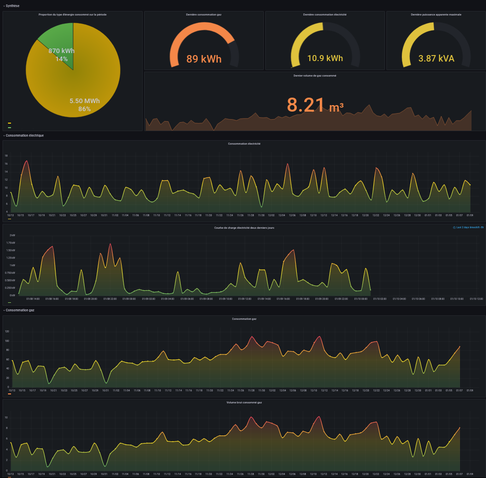

# Tableau de suivi de la consommation énergétique



## Installation

1. Installer Docker
2. [Obtenir des jetons d'accès ENEDIS](https://conso.vercel.app/)
3. Copier le fichier `maConso/secrets/secrets.json` vers `secrets/secrets.json`
4. Editer `secrets/secrets.json` avec vos identifiants ENEDIS et/ou GRDF
5. Lancer la commande `docker compose up --build -d`
6. Se rendre sur l'interface Grafana http://localhost:3000/, les identifiants par défauts sont admin/admin

Un tableau de bord préconfiguré est déjà disponible, mais vous pouvez en créer un autre à partir des données collectées dans la base de données.


### Exemples de requêtes

#### Consommation électricité (kWh)

```SQL
from(bucket: "maconso")
  |> range(start: v.timeRangeStart, stop: v.timeRangeStop)
  |> filter(fn: (r) => r["_measurement"] == "ENEDIS__ENERGIE_SOUTIRAGE")
  |> filter(fn: (r) => r["_field"] == "kWh")
```

#### Puissance apparente maximale (kVA)

```SQL
from(bucket: "maconso")
  |> range(start: v.timeRangeStart, stop: v.timeRangeStop)
  |> filter(fn: (r) => r["_measurement"] == "ENEDIS__PMAX_SOUTIRAGE")
  |> filter(fn: (r) => r["_field"] == "kVA")
```

#### Courbe de charge électricité

```SQL
from(bucket: "maconso")
  |> range(start: v.timeRangeStart, stop: v.timeRangeStop)
  |> filter(fn: (r) => r["_measurement"] == "ENEDIS__CDC_SOUTIRAGE")
  |> filter(fn: (r) => r["_field"] == "kWh")
```

#### Consommation gaz (kWh)

```SQL
from(bucket: "maconso")
  |> range(start: v.timeRangeStart, stop: v.timeRangeStop)
  |> filter(fn: (r) => r["_measurement"] == "GRDF__CONSOMMATION")
  |> filter(fn: (r) => r["_field"] == "kWh")
```

#### Consommation gaz (m3)

```SQL
from(bucket: "maconso")
  |> range(start: v.timeRangeStart, stop: v.timeRangeStop)
  |> filter(fn: (r) => r["_measurement"] == "GRDF__CONSOMMATION")
  |> filter(fn: (r) => r["_field"] == "m3")
```

#### Filtrer par compteur

Les enregistrements incluent un tag contenant le numéro du compteur (PRM pour Linky et PCE pour Gazpar), ainsi si vous possédez un accès à plusieurs compteurs, vous pouvez filtrer les données pour ne sélectionner qu'un compteur:

```SQL
from(bucket: "maconso")
  |> range(start: v.timeRangeStart, stop: v.timeRangeStop)
  |> filter(fn: (r) => r["_measurement"] == "ENEDIS__ENERGIE_SOUTIRAGE")
  |> filter(fn: (r) => r["PRM"] == "06587593521409")
  |> filter(fn: (r) => r["_field"] == "kWh")
```